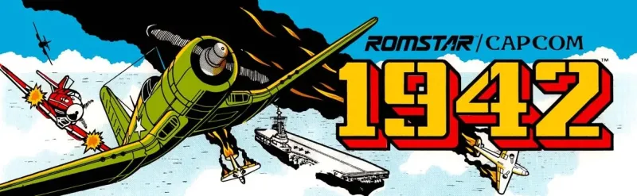

1942

## [Play the Game!](https://kubraty.github.io/1942-retro-games/)

## Description
1942 Game is a classic arcade-style shoot 'em up game inspired by the iconic 1942 game title. Take control of a fighter plane and navigate through intense aerial battles, facing waves of enemy planes and challenges.

## Main Functionalities
- **Player Control:** Pilot your fighter plane using arrow keys or specified controls.
- **Enemy Waves:** Encounter waves of enemy planes with increasing difficulty.
- **Score System:** Earn points by shooting down enemy planes.
- **Lives System:** Manage your limited lives and survive as long as possible.

## Backlog Functionalities
- **Sound Enhancements:** Fine-tune sound effects and background music for a more immersive experience.
- **Responsive Design:** Optimize the game for different screen sizes and devices.

## Technologies Used
- HTML
- CSS
- JavaScript
- DOM Manipulation
- JS Classes
- JS Audio() and JS Image()

## Data structure
- Game includes start(), gameLoop(), update(), endGame().
- Player includes move(), updatePosition(), shoot(), updateBullets().
- Enemy includes updatePosition(), move().
- Effect includes remove().
- Bullet includes move(), updatePosition(), didShooted().
- AudioPlayer includes load(), play(), stop(), getSupportedSource().

## States
- Start Screen
- Game Screen

Task
List of tasks in order of priority

## Links
Slides Link
## [Github repository Link] (https://github.com/KubraTY/1942-retro-games)
## [Deployment Link] ((https://kubraty.github.io/1942-retro-games/))